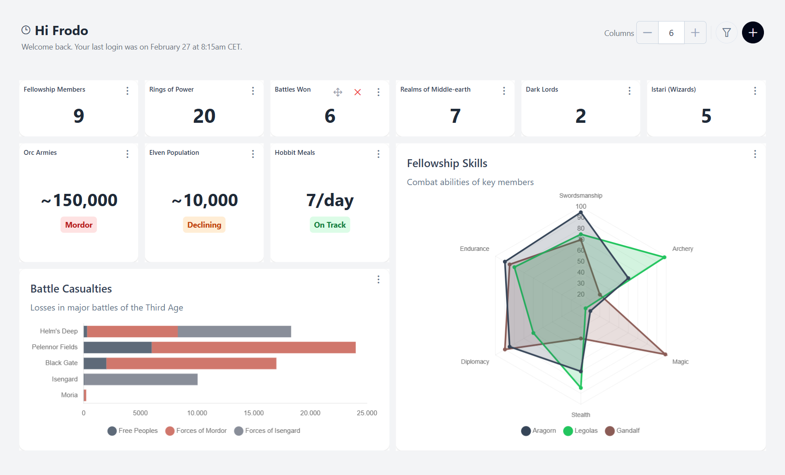

# Dynamic Dashboard

A dynamic, interactive dashboard built with **Angular 21**, **Tailwind CSS 4**, and **PrimeNG 21** — showcasing drag-and-drop layouts, resizable widgets, real-time data loading with skeleton states, and a fully signal-based architecture.

> Built as a frontend technical assessment focused on **code quality**, **architecture**, and **attention to detail**.



---

## Table of Contents

- [Features](#features)
- [Tech Stack](#tech-stack)
- [Getting Started](#getting-started)
- [Project Structure](#project-structure)
- [Architecture](#architecture)
- [State Management](#state-management)
- [Styling Strategy](#styling-strategy)
- [Testing](#testing)
- [Accessibility](#accessibility)
- [Design Decisions](#design-decisions)

---

## Features

| Feature                        | Description                                                                 |
| ------------------------------ | --------------------------------------------------------------------------- |
| **Drag-and-drop**              | Reposition widgets freely via a dedicated drag handle (Gridster2)           |
| **Resizable widgets**          | Resize any widget by dragging its edges; layout auto-compacts               |
| **Dynamic column control**     | Adjust grid columns (1–12) with automatic collision resolution              |
| **Widget catalog**             | Add new widgets from a categorized popup menu                               |
| **Remove widgets**             | Remove any widget via its action toolbar                                    |
| **Type filtering**             | Filter visible widgets by type (KPI, Stat, Chart) via a popover             |
| **Loading skeletons**          | PrimeNG skeleton placeholders shown during simulated API latency (1–2s)     |
| **Chart download**             | Export any chart widget as a PNG image                                      |
| **Multiple widget types**      | KPI cards, stat cards with severity badges, bar/radar/horizontal-bar charts |
| **Container-query responsive** | Widget content scales based on its own dimensions, not the viewport         |
| **Mock API**                   | HTTP interceptor simulates backend endpoints with realistic delays          |
| **Lazy-loaded routes**         | Dashboard module loaded on demand for optimal initial bundle size           |

---

## Tech Stack

| Technology        | Version | Purpose                                                                |
| ----------------- | ------- | ---------------------------------------------------------------------- |
| Angular           | 21      | Application framework                                                  |
| TypeScript        | 5.9     | Type-safe development                                                  |
| Tailwind CSS      | 4       | Utility-first styling with design tokens                               |
| PrimeNG           | 21      | UI component library (Card, Skeleton, Chart, Popover, Menu, Tag, etc.) |
| Chart.js          | 4.5     | Chart rendering (via PrimeNG Chart wrapper)                            |
| angular-gridster2 | 21      | Grid layout engine with drag-and-drop + resize                         |
| Vitest            | 4.0     | Unit testing (Angular builder integration)                             |
| RxJS              | 7.8     | HTTP layer (Observables from HttpClient)                               |

---

## Getting Started

```bash
# Install dependencies
npm install

# Start dev server (http://localhost:4200)
ng serve

# Run unit tests
ng test

# Production build
ng build
```

---

## Project Structure

```
src/app/
├── models/              # Type definitions and constants (WidgetType, Widget, WidgetConfig)
├── data/                # Mock data and default layout configuration
├── repositories/        # HTTP layer — pure API calls, no business logic
├── services/            # State management and business logic (signals)
├── interceptors/        # Mock API interceptor (simulates backend)
├── views/               # Smart (container) page components
└── components/
    ├── dashboard-header/  # Toolbar: column control, type filters, add-widget menu
    └── widget-host/       # Widget orchestrator: loading state, type dispatch, actions
        ├── kpi-card/      # Simple numeric KPI display
        ├── stat-card/     # Value + severity badge
        ├── chart-card/    # Chart.js charts (bar, radar, horizontal bar)
        └── shared/        # PrimeNG Card pass-through configurations
```

---

## Architecture

### Layered Design

The architecture follows a clean **separation of concerns** with distinct layers:

```
┌─────────────────────────────────────────────────────┐
│  Views (Smart Components)                           │
│  Wire services to templates, no direct HTTP calls   │
├─────────────────────────────────────────────────────┤
│  Components (Presentational / Dumb)                 │
│  Input/output only — no injected services           │
├─────────────────────────────────────────────────────┤
│  Services                                           │
│  Business logic, state management (signals)         │
├─────────────────────────────────────────────────────┤
│  Repositories                                       │
│  Pure HTTP calls — URL construction + HttpClient    │
├─────────────────────────────────────────────────────┤
│  Interceptors                                       │
│  Mock API — intercepts /api/* and returns test data │
└─────────────────────────────────────────────────────┘
```

### Repository Pattern

The `DashboardRepository` is a thin HTTP layer with a single responsibility: constructing URLs and making `HttpClient` calls. It owns no state and performs no transformations — keeping the HTTP concern completely isolated from business logic.

### Smart vs. Dumb Components

- **Smart components** (`DashboardPage`) inject services, manage data flow, and coordinate child components.
- **Dumb components** (`DashboardHeader`, `KpiCard`, `StatCard`, `ChartCard`) communicate exclusively through `input()` and `output()` — they are fully reusable and testable in isolation.
- **`WidgetHost`** acts as an orchestrator — it receives a widget configuration, displays a skeleton while loading, and delegates rendering to the appropriate card component.

### Mock API Interceptor

A functional `HttpInterceptorFn` intercepts all `/api/*` requests and returns mock data with a randomized 1–2 second delay — simulating a real backend without any external dependencies. This approach allows the entire application to run standalone while demonstrating proper HTTP patterns (loading states, async data flow).

---

## State Management

The application uses **Angular Signals exclusively** for state management — no external state libraries, no RxJS `BehaviorSubject` for state.

| Signal               | Type         | Location           | Purpose                                   |
| -------------------- | ------------ | ------------------ | ----------------------------------------- |
| `widgets`            | Writable     | `DashboardService` | Full widget list with position + data     |
| `widgetCatalog`      | Writable     | `DashboardService` | Available widgets for the add-widget menu |
| `columns`            | Writable     | `DashboardService` | Active grid column count                  |
| `typeFilter`         | Writable     | `DashboardService` | `Set<WidgetType>` controlling visibility  |
| `gridOptions`        | Writable     | `DashboardService` | Gridster configuration                    |
| `filteredWidgets`    | **Computed** | `DashboardService` | Widgets filtered by active types          |
| `addWidgetMenuItems` | **Computed** | `DashboardService` | Menu items derived from catalog           |
| `userProfile`        | Writable     | `UserService`      | User name and last login timestamp        |

### Key Principles

- **Immutable updates** — All signal mutations use `.update()` returning new arrays/objects; no direct mutation.
- **Computed derived state** — `filteredWidgets` and `addWidgetMenuItems` are `computed()` signals that automatically re-evaluate when dependencies change.
- **RxJS only for HTTP** — Observables are used solely for `HttpClient` responses; all application state flows through signals.

---

## Styling Strategy

### Design Tokens

All visual values are defined as **CSS custom properties** (design tokens) in a centralized `@theme` block — no hardcoded colors, spacing, or font sizes anywhere in the codebase:

```css
/* Examples from the token system */
--color-primary, --color-primary-darker, --color-danger
--surface-card, --surface-main, --surface-elevated
--text-primary, --text-secondary, --text-tertiary
--spacing-xs, --spacing-sm, --spacing-md, --spacing-lg
--radius-md, --radius-lg
--font-sm, --font-base, --font-lg, --font-xl, --font-4xl
```

Tailwind v4 exposes these as utilities (`bg-surface-card`, `text-text-secondary`, `p-md`, `rounded-lg`), ensuring a **single source of truth** for the entire design system.

### Container Queries

Widget cards use **CSS `@container` queries** instead of viewport-based breakpoints. This means a KPI card scales its typography based on the card's own dimensions — critical for a dashboard where widget sizes are user-controlled:

```css
@container (min-width: 200px) {
  .kpi-value {
    font-size: var(--font-4xl);
  }
}
@container (min-width: 120px) {
  .kpi-value {
    font-size: var(--font-xl);
  }
}
```

### PrimeNG Pass-Through

PrimeNG components are customized via the **pass-through API** (`pt` objects) with Tailwind classes — avoiding CSS overrides and keeping styling consistent with the utility-first approach.

---

## Testing

**12 spec files** covering every architectural layer, run with Vitest and Angular's `TestBed`:

```bash
ng test
```

### Coverage by Layer

| Layer           | Files Tested                                                                               | What's Verified                                                                |
| --------------- | ------------------------------------------------------------------------------------------ | ------------------------------------------------------------------------------ |
| **Models**      | `widget.model.spec.ts`                                                                     | Type constants, config completeness, mock data integrity                       |
| **Repository**  | `dashboard.repository.spec.ts`                                                             | Correct URLs, HTTP methods, response mapping (`HttpTestingController`)         |
| **Interceptor** | `mock-api.interceptor.spec.ts`                                                             | Each mock endpoint returns correct data; unknown URLs pass through             |
| **Services**    | `dashboard.service.spec.ts`, `user.service.spec.ts`                                        | CRUD operations, column collision resolution, grid config, type filtering      |
| **Views**       | `dashboard.page.spec.ts`                                                                   | Component wiring, child component rendering, widget count                      |
| **Components**  | `dashboard-header.spec.ts`, `widget-host.spec.ts`, `kpi-card.spec.ts`, `stat-card.spec.ts` | Input/output contracts, skeleton states, card type dispatch, action visibility |

### Notable Test Quality

- **`DashboardService` tests** are particularly thorough — they verify collision detection, overlap prevention, visual order preservation during column changes, and correct 1-column stacking behavior.
- **`HttpTestingController`** is used for repository tests, verifying exact API URLs and HTTP methods.
- **Component tests** verify both rendering and behavior — output emissions, conditional rendering, and skeleton visibility.

---

## Accessibility

The dashboard follows **WCAG AA** guidelines:

- **ARIA labels** on all icon-only buttons (`aria-label="Filter widgets"`, `"Add widget"`, `"Remove widget"`, `"Download chart"`, `"Drag to reorder"`)
- **Form label associations** — All inputs have proper `<label for="...">` / `inputId` pairings
- **Semantic HTML** — `<header>`, `<h1>` page heading, structured content hierarchy
- **Cursor feedback** — Drag handles show `cursor-grab` / `active:cursor-grabbing`
- **Keyboard accessible** — PrimeNG components provide built-in keyboard navigation

---

## Design Decisions

| Decision                                 | Rationale                                                                                                    |
| ---------------------------------------- | ------------------------------------------------------------------------------------------------------------ |
| **Signals over RxJS for state**          | Simpler mental model, less boilerplate, native Angular reactivity — RxJS reserved for where it excels (HTTP) |
| **Repository pattern**                   | Isolates HTTP from business logic; easy to swap mock interceptor for a real backend                          |
| **Functional interceptor**               | Lighter than class-based; aligns with Angular's modern functional API direction                              |
| **Container queries over media queries** | Dashboard widgets resize independently — their content must respond to their own dimensions                  |
| **Vitest over Karma**                    | Faster execution, modern ESM support, better DX with Angular 21's native builder                             |
| **`OnPush` on every component**          | Maximizes change detection performance; signals guarantee correct updates                                    |
| **PrimeNG pass-through API**             | Avoids CSS overrides; styling stays in the template with Tailwind classes                                    |
| **Gridster2 drag handle**                | Prevents accidental drags when interacting with widget content (charts, buttons)                             |
| **Lazy-loaded route**                    | Keeps initial bundle lean; dashboard loads on navigation                                                     |

---

## Scripts

| Command    | Description                              |
| ---------- | ---------------------------------------- |
| `ng serve` | Start development server with hot reload |
| `ng test`  | Run unit tests with Vitest               |
| `ng build` | Production build (output in `dist/`)     |
